## Creating Deployments

### Deployments Core Concepts
A ReplicaSet is a declarative way to manage pods
A Deployment is a declarative way to manage pods using a ReplicaSet

Pods, Deployments, and ReplicaSets
- Deployments and ReplicaSets ensure Pods stay running and can be used to scale Pods

The Role of `ReplicaSets`
- ReplicaSets act as a Pod controller:
  - ensures the requested number of pods are available through a self-healing mechanism (it creates a new pod if an existing pod goes down)
  - can be used to scale pods horizontally
  - relies on a pod template
    - no need to create pods directly!

The Role of `Deployments`
- A Deployment manages ReplicaSets which in turn manage pods:
  - scales ReplicaSets, which scale pods
  - supports zero-downtime updates by creating and destroying ReplicaSets
  - provides rollback functionality
  - creates a unique label that is assigned to the ReplicaSet and generated pods
  - YAML is very similar to a ReplicaSet

### Creating a Deployment

Deployment is a higher level wrapper around ReplicaSet

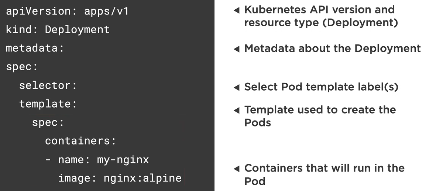

A selector is used to "select" the template to use based on labels.

### kubectl and Deployments
```sh
# Start Deployments
k apply -f nginx.deployment.yml

# Describe Deployments
k describe deployment my-nginx

# List all Deployments and their labels
k get deployments --show-labels

# Get all Deployments with a specific label
k get deployments -l app=nginx

# Delete Deployment
k delete deployment [deployment-name]

# Scale the Deployment pods
k scale deployment [deployment-name] --replicas=5
```

`resources` allows you to constrain what a given container is allowed to run in terms of memory and CPU, etc.

### Deployment options
Zero downtime deployments allow software updates to be deployed to production without impacting end users

- Rolling updates (default)
- Blue-green deployments
  - once new deployments are proven good, traffic is routed over to the new deployments
- Canary deployments
  - small amount of traffic goes to the new deployments
- Rollbacks

## Creating Services

### Services Core Concepts
A service provides a single point of entry for accessing one or more pods
We cannot rely on IP addresses of pods because they live and die. That's why we need services to manage them at a higher level.

Pods are "mortal" and may only live a short time (ephemeral). You can't rely on a pod IP address staying the same. Pods can also horizontally scale. A pod gets an IP address after it has been scheduled (no way for clients to know the IP address ahead of time).

The Role of Services
- services abstract pod IP addresses from consumers
- load balances between pods
- labels associate a service with a pod
- node's kube-proxy creates a virtual IP for services
- Layer 4 (TCP/UDP over IP)
- Services are not ephemeral
- Creates endpoints which sit between a service and a pod

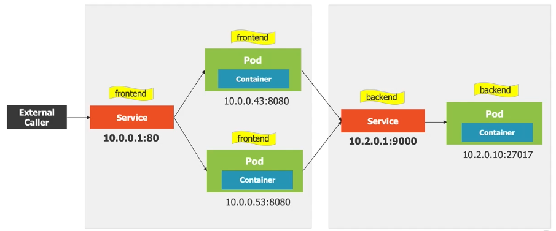

### Service Types

ClusterIP Service
- Internal to cluster (default)
- Only pods within the cluster can talk to the service
- Purpose of ClusterIP is to give each pod an IP address
  - Services and pods are joined together by labels and selectors

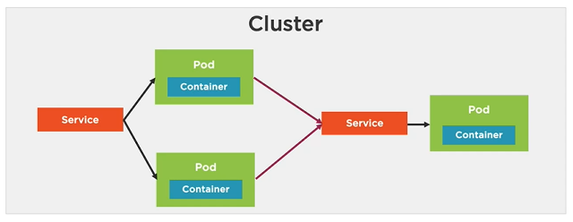

NodePort Service
- Exposes the service on each Node's IP at a static port
- allocates a port from a range (default is 30000-32767)
- each Node proxies the allocated port

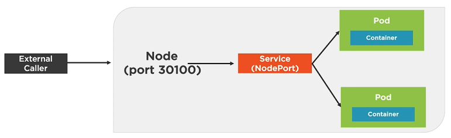

LoadBalancer Service
- Exposes a service externally
- Useful when combined with a cloud provider's load balancer
- NodePort and ClusterIP services are created
- Each node proxies the allocated port

ExternalName Service
- Service that acts as an alias for an external service
- External service details are hidden from cluster

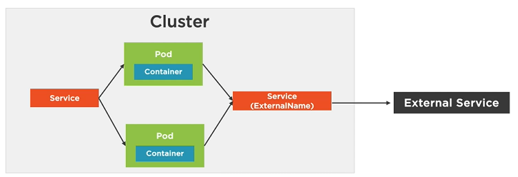

### Creating a Service with kubectl

```sh
# Listen on port 8080 locally and forward to service's pod
k port-forward service/[service-name] 8080
```

### Creating a Service with YAML
```yaml
apiVersion: v1
kind: Service
metadata:
  name: frontend # name of service (each service gets a DNS entry, which can be used in place of the actual IP address)
```

ClusterIP Service
```yaml
apiVersion: v1
kind: Service
metdata:
  name: nginx-clusterip # DNS name
spec:
  type: ClusterIP
  selector:
    app: my-nginx
  ports:
  - port: 8080
    targetPort: 80
```

NodePort Service
```yaml
apiVersion: v1
kind: Service
spec:
  type: NodePort
  selector:
    app: nginx
  ports:
  - port: 80
    targetPort: 80
    nodePort: 31000
```

LoadBalancer Service
```yaml
apiVersion: v1
kind: Service
spec:
  type: LoadBalancer
  selector:
    app: nginx
  ports:
  - port: 80
    targetPort: 80
```

ExternalName Service
```yaml
apiVersion: v1
kind: Service
metadata:
  name: external-service # other pods can use this alias to access the external service
spec:
  type: ExternalName
  externalName: api.acmecorp.com
  ports:
  - port: 9000
```

### kubectl and Services
```sh
# Update a Service
k apply -f file.service.yml

# Delete a Service
k delete -f file.service.yml
k delete service [service-name]

# Get services
k get services

# Testing a Service and Pod with curl
# Grab the IP address of a pod (podIP)
k get pod [pod-name] -o yaml

# Shell into a Pod and test a URL
k exec [pod-name] -- curl -s http://podIP

# Install and use curl
k exec [pod-name] -it sh
> apk add curl
> curl -s http://podIP
```

## Understanding Storage Options
### Storage Core Concepts
Q: How do you store application state/data and exchange it between pods with kubernetes?
A: Volumes (although other data storage options exist such as database)

A volume can be used to hold data and state for pods and containers.
- pods live and die so their file system is short lived
- volumes can be used to store state/data and use it in a pod
- a pod can have multiple volumes attached to it
- containers rely on a mountPath to access a volume

A volume references a storage location
- a volume references a storage location
- it must have a unique name
- it is attached to a pod and may or may not be tied to the pod's lifetime
- a volume mount references a volume by name and defines a mountPath

Volume Types
- emptyDir
  - for storing "transient" data useful for sharing files between containers running in a pod (tied to the lifetime of the pod)
- hostPath
  - pod mounts into the node's filesystem
  - could cause a problem if a pod is rescheduled in a different node
- nfs
  - an NFS (Network File System) share mounted into the pod
- configMap/secret
  - sepcial types of volumes that provide a pod with access to kubernetes resources
- persistentVolumeClaim
  - provides pods with a more persistent storage option that is abstracted from the details
- cloud
  - cluster-wide storage

PersistentVolume
- a cluster-wide storage resource that relies on network-attached storage (NAS)
- available to a pod even if the pod gets rescheduled to a different node
- relies on a storage provider such as NFS, cloud storage or other options
- associated wit ha pod by using a PersistentVolumeClaim (PVC), which is a request for a storage unit (PV)

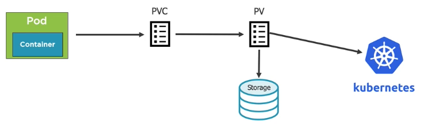
1. Create a PersistentVolume
2. Create a PersistentVolumeClaim

[Kubernetes examples](https://github.com/kubernetes/examples)

StorageClasses
- used to define different "classes" of storage, acting as a type of storage template
- supports dynamic provisioning of PersistentVolumes

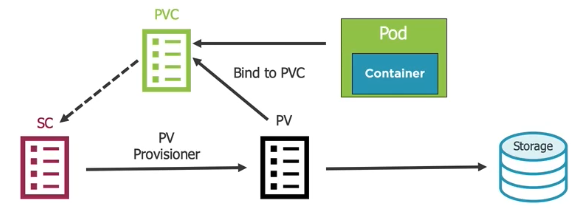
1. A pod's volume references PersistentVolumeClaim
2. PersistentVolumeClaim references StorageClass
3. Kubernetes uses StorageClass provisioner to dynamically provision a PersistentVolume
4. PersistentVolume provisions/binds to the Storage
5. PersistentVolume binds to PersistentVolumeClaim

Any properties from StorageClass template will be available to PersistentVolume and PersistentVolumeClaim

## Creating ConfigMaps and Secrets

### ConfigMap Core Concepts

ConfigMap
- provides a way to inject configuration data into a container
- can store entire files or provide key/value pairs:
  - store in a file
  - provide from command line
  - ConfigMap manifest

Accessing ConfigMap Data in a Pod
- ConfigMaps can be accessed from a pod using:
  - environment variables (key/value)
  - ConfigMap Volume (access as files)

### Creating a ConfigMap

Defining values in a ConfigMap manifest
```yaml
apiVersion: v1
kind: ConfigMap
metadata:
  name: app-settings
  labels:
    app: app-settings
data:
  enemies: aliens
  lives: "3"
  enemies.cheat: "true"
  enemies.cheat.level=noGoodRotten
```

Ways to create a ConfigMap
```sh
# Create a ConfigMap using data from a file
k create configmap [configmap-name] --from-file=[path-to-file]

# Create ConfigMap using data from an env file
k create configmap [configmpa-name] --from-env-file=[path-to-file]

# Create ConfigMap from individual data values
k create configmap [cm-name] --from-literal=exampleKey=exampleValue

# Create from a ConfigMap manifest
k create -f file.configmap.yml
```

### Using a ConfigMap
```sh
# get all configmaps
k get configmap

# get configmap info
k get configmap [configmap-name] -o yaml
k get cm [configmap-name] -o yaml
```

Environment Variables
- envFrom can be used to load all ConfigMap keys/values into environment variables

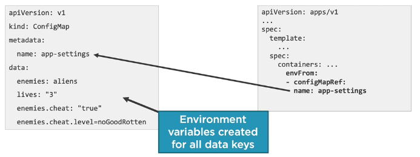

Volume
- ConfigMap values can be loaded through a volume
- Each key is converted to a file - value is added into the file

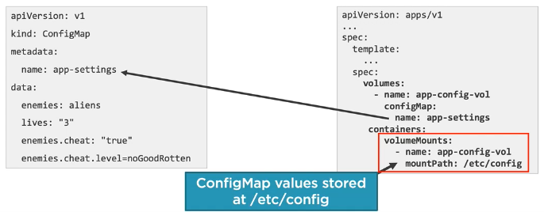

### Secrets Core Concepts
Secret
- an object that contains a small amount of sensitive data such as passwords, tokens, keys, etc
- k8s can store sensitive information
- avoids storing secrets in container images, files or deployment manifests
- mount secrets into pods as files or as environment variables
- k8s only makes secrets available to nodes that have a pod requesting the secret
- secrets are stored in tmpfs on a node (not on disk)

Secrets Best Practices
- enable encryption at rest for cluster data
- limit access to etcd (where secrets are stored) to only admin users
- use SSL/TLS for etcd peer-to-peer communication
- manifest (YAML/JSON) files only base64 encode the secrets
- pods can access secrets so secure which users can create pods. Role-based access control (RBAC) can be used.

Creating a secret
```sh
# Create a secret and store securely in k8s
k create secret generic [secret-name] --from-literal=pwd=my-password

# Create a secret from a file
k create secret generic [secret-name] \
--from-file=ssh-privatekey=~/.ssh/id_rsa \
--from-file=ssh-publickey=~/.ssh/id_rsa.pub

# Create a secret from a key pair
k create secret tls [secret-name] --cert=path/to/tls.cert \
--key=path/to/tls.key

# Get secrets
k get secrets

# Get YAML for specific secret
k get secrets [secret-name] -o yaml
```

Accessing a secret: environment variables
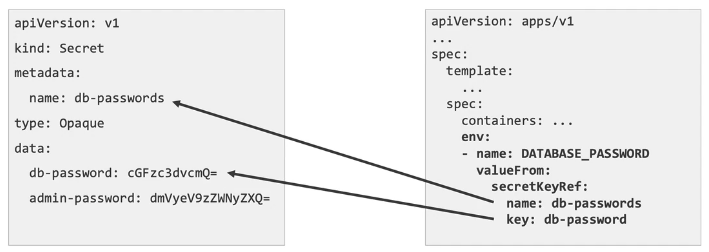

Accessing a secret: volumes
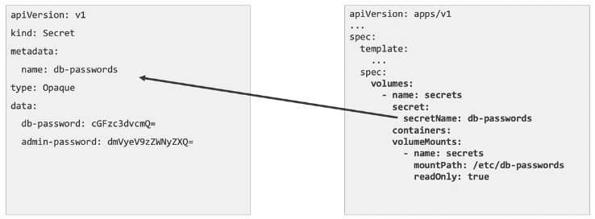
 
## Putting it all together
### Troubleshooting Techniques

```sh
# View the logs for a pod's container
k logs [pod-name]

# View the logs for a specific container within a pod
k logs [pod-name] -c [container-name]

# View the logs for a previously running pod
k logs -p [pod-name]

# Stream a pod's logs
k logs -f [pod-name]
```

```sh
# Describe a pod
k describe pod [pod-name]

# Change a pod's output format
k get pod [pod-name] -o yaml

# Change a deployment's output format
k get deployment [deployment-name] -o yaml

# Shell into a pod container
k exec [pod-name] -it sh
```
