## Kubernetes Deployments Overview

### The Big Picture

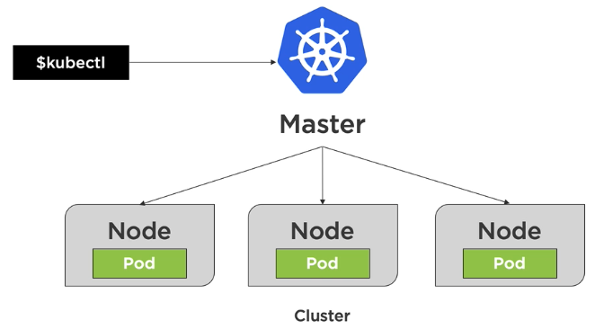

Node is basically a virtual machine. There are two types of nodes: master nodes and worker nodes. Worker nodes host pods. Pods run containers. The goal of deployments is to deploy pods. 

### Kubernetes Resources


- Deployment relies on a ReplicaSet. ReplicaSet makes sure that the number of pods we requested are up and running. The pod template defined in a deployment determines what container(s) to run inside a pod.
  - Deployment is a declarative way to manage pods using a ReplicaSet.
  - ReplicaSet is a declarative way to manage pods.
- Services allow the pods to talk to each other.
- Storage for external storage.
- ConfigMaps for configuration data.
- Secrets for sensitive data.

### Creating an initial deployment

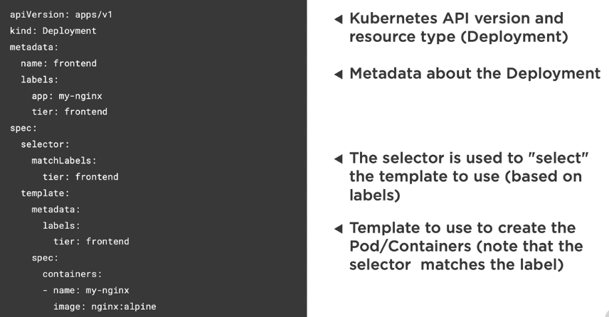

```sh
# Create or apply changes to a deployment
k apply -f file.deployment.yml

# Scale the deployment pods to 5
k scale deployment [deployment-name] --replicas=5
```

### Kubernetes Deployment Options

1. Rolling update deployments
2. Canary deployments
3. Blue-green deployments

### Understanding rolling update deployments

> Rolling updates allow deployments' update to take place with zero downtime by incrementally updating pods instances with new ones

- ReplicaSets increase new pods while decreasing old pods one pod at a time
- Service handles load balancing traffic to available pods
- New pods only scheduled on available nodes
- Deployments support two strategy options:
  - rolling update
  - recreate (not good bc you will experience downtime)
- Rolling update is the default strategy for a deployment

### Creating a rolling update deployment

```yaml
apiVersion: apps/v1
kind: Deployment
metadata:
  name: frontend
spec:
  replicas: 2 # num of pod replicas
  minReadySeconds: 1 # time to wait to be considered healthy
  progressDeadlineSeconds: 60 # time to wait before reporting stalled deployment
  revisionHistoryLimit: 5 # num of ReplicaSets that can be rolled back (default is 10)
  strategy:
    type: RollingUpdate
    rollingUpdate:
      maxSurge: 1 # max num of pods that can exceed the replicas count
      maxUnavailable: 1 # max num of pods that can be unavailable
```

```sh
# Create initial deployment and record in the revision history
k apply -f file.deployment.yml --record

# Get information about a deployment
k rollout status deployment [deployment-name]
```

### Rolling back deployments
Rolling update revisions can be tracked using `--record`

If a deployment has issues, a new deployment can be applied or you can revert to a previous revision

```sh
# Get information about a deployment
k rollout history deployment [deployment-name]

# Describe a deployment revision
k rollout history deployment [deployment-name] --revision=2

# Check status
k rollout status -f file.deployment.yml

# Rollback a deployment
k rollout undo -f file.deployment.yml

# Rollback to a specific revision
k rollout undo deployment [deployment-name] --to-revision=2
```

## Performing canary deployments

Canary deployment
- Rollout a new deployment but only route a small percentage of the overall traffic to it to ensure it's working properly
- Strategy for checking the viability of a deployment by comparing against the baseline before promoting or rejecting the deployment
- Run two identical production environments at the same time
- Canary deployment is setup to receive minimal traffic
- Once the canary deployment is verified, it can be scaled up and existing stable deployment can be scaled down

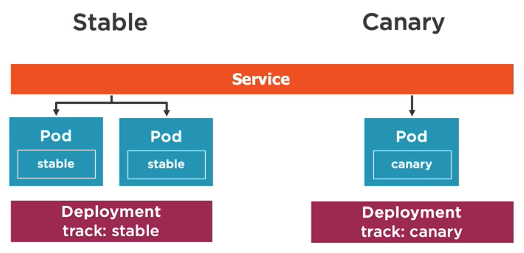

### Creating a canary deployment

A canary deployment involves 3 main kubernetes resources:
- Service
- Stable deployment
- Canary deployment

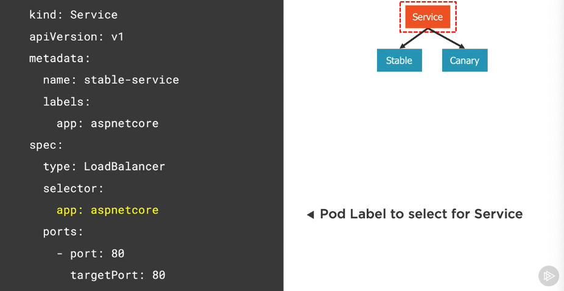
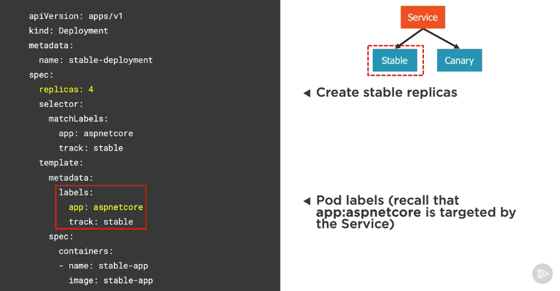
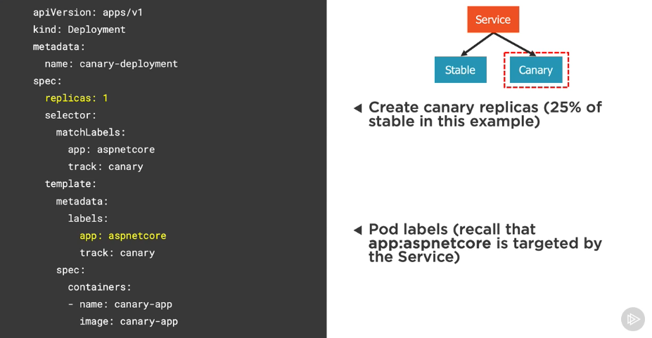

## Performing blue-green deployments

Blue-green deployment
- strategy for checking the viability of a deployment before it's publicly available
- Run two identical production environments at the same time
  - `Blue`: old application
  - `Green`: new application
- Route traffic from `blue` to `green` when checks on the `green` environment have passed

Blue-green deployment flow
1. Create `blue` and `green` deployment and services
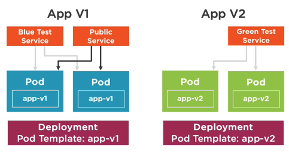
2. Check that everything is good in `green` deployment
3. Change public service from `blue` to `green`
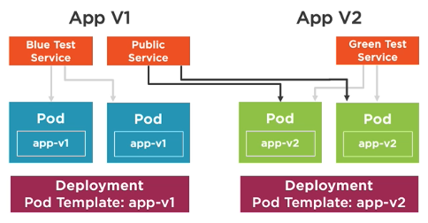
4. Remove `blue` deployment and services
5. Now the `green` environment technically becomes the `blue` environment

Key considerations
- How many pods are being deployed to each environment?
- How much memory is required to run the pods?
- What are the CPU requirements?
- Volumes, sessions, node affinity, etc

### Creating a blue-green deployment

Define a blue test service
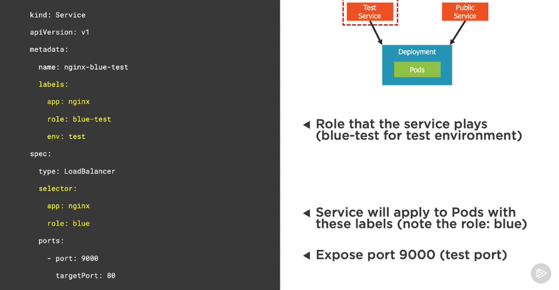

Define a blue public service
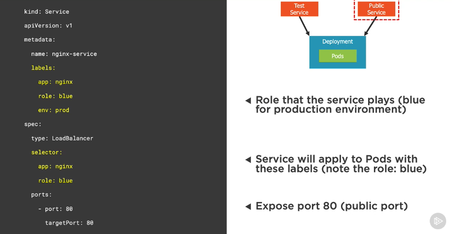

Define a blue deployment
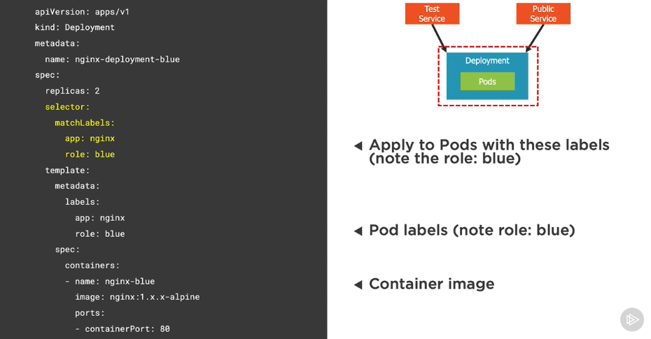

Changing from `blue` to `green`
- Once a `green` deployment has been successfully rolled out and tested, change the public service's selector to `green`
  - We can either change the service YAML (declarative) or change the service's selector to `green` (imperative)
- In the example, we can achieve this by pointing the service's selector from `role: blue` to `role: green`

```sh
# Change the role in service's YAML (declarative)
k apply -f file.service.yml

# Change the role using CLI (imperative)
k set selector svc [service-name] 'role=green'
```

## Running Jobs and CronJobs

### Understanding Jobs

Jobs
- A job creates pod(s) that perform a task or batch process
- Unlike standard pods, a job doesn't run indefinitely
  - Once a job is deleted, its pods are removed
- A job can be configured to run multiple pods in parallel
- Successful completions are tracked
- Use cases:
  - Retrieve and cache remote data
  - Perform backup
  - Move data between DBs
  - Process queues

### Understanding CronJobs

CronJobs
- A CronJob is a job that runs on a scheduled basis
- Scheduled using the cron format
- CronJob names must be less than 52 characters

Understanding the cron format

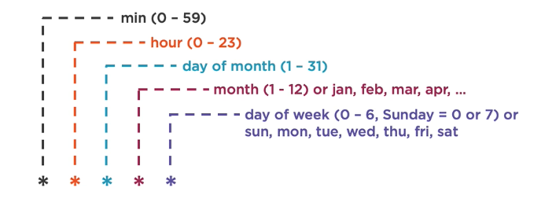

| Cron          | Schedule                                    |
| ------------- | ------------------------------------------- |
| `0 * * * *`   | @hourly - run once every hour               |
| `0 0 * * *`   | @daily - run once every day at midnight     |
| `0 0 * * 0`   | @weekly - run once every week               |
| `0 0 1 * *`   | @monthly - run once every month             |
| `0 0 1 1 *`   | @yearly - run once every year               |
| `30 22 * * 1` | Run at 22:30 every Monday                   |
| `1 0 1 * *`   | Run at 00:01 on the first day of each month |
| `*/1 * * * *` | Run once every minute                       |

[crontab guru](https://crontab.guru)

### Defining a job
```yaml
apiVersion: batch/v1 # Batch API
kind: Job # Job kind
metadata:
  name: pie-counter
spec:
  template:
    metadata:
      name: pie-counter
    spec:
      restartPolicy: Never # never try to restart when it fails (Never | OnFailure)
      containers:
      - name: pie-counter
        image: alpine
        command: # job command to run
          - "sh"
          - "-c"
          - "echo 'scale=1000; 4*a(1)' | bc -l;sleep 2;"
```

### Defining a job that requires multiple completions
```yaml
apiVersion: batch/v1
kind: Job
metadata:
  name: pie-counter
spec:
  completions: 4 # run 4 pods sequentially (specifies the number of pods that must complete successfully)
  activeDeadlineSeconds: 240 # how long can the job be active before it's terminated
  template:
    ...
```

### Defining a job that can run in parallel
```yaml
apiVersion: batch/v1
kind: Job
metadata:
  name: pie-counter
spec:
  completions: 4 # 4 pods must complete successfully
  parallelism: 2 # 2 pods can run in parallel at a time
  activeDeadlineSeconds: 240
  template:
    ...
```

### Defining a CronJob
```yaml
apiVersion: batch/v1beta1
kind: CronJob
metadata:
  name: pie-counter
spec:
  concurrencyPolicy: Allow # allow multiple pods to run event if their scheduling overlaps (Allow | Forbid | Replace)
  schedule: "*/1 * * * *" # run the job every minute
  jobTemplate:
    spec:
      template:
        spec:
          restartPolicy: OnFailure # restart if it fails
          containers:
            ...
```

### Creating a Job/CronJob

```sh
# Create a new job
k create -f file.job.yml --save-config

# Create or modify a job
k apply -f file.job.yml

# Get jobs
k get jobs
k get job [job-name] -o yaml

# Get CronJobs
k get cronjobs
k get cronjob [job-name] -o yaml

# Describe jobs
k describe job [job-name]
```

## Performing monitoring

### Web UI Dashboard

Web UI (Dashboard) is a web-based Kubernetes user interface. It hooks into the kubernetes API to visualize your Kubernetes cluster. Everything in the dashboard could be found through `kubectl`.

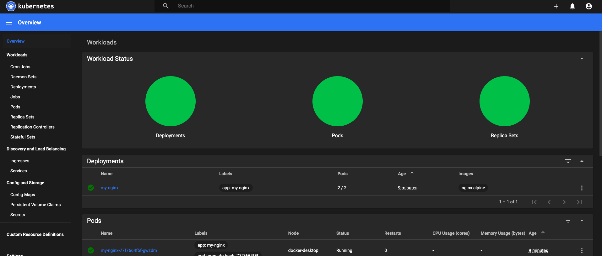

```sh
# Dashboard UI
k apply -f https://raw.githubusercontent.com/kubernetes/dashboard/v2.0.0/aio/deploy/recommended.yaml

# Get token
k -n kubernetes-dashboard describe secret $(kubectl -n kubernetes-dashboard get secret | grep admin-user | awk '{print $1}')

# Run proxy
k proxy

# Visit http://localhost:8001/api/v1/namespaces/kubernetes-dashboard/services/https:kubernetes-dashboard:/proxy/
```

### Metrics Server, kube-state-metrics, Prometheus
`Metrics Server` is a cluster-wide aggregator of resource usage data. It is deployed by default in clusters created by kube-up.sh script as a deployment object.

`kube-state-metrics` is a simple service that listens to the Kubernetes API server and generates metrics about the state of the objects. It is not focused on the health of the individual Kubernetes components, but rather on the health of the various objects inside, such as deployments, nodes and pods.

`Prometheus` is an open-source systems monitoring and alerting toolkit originally built at SoundCloud. Prometheus joined the Cloud Native Computing Foundation in 2016 as the second hosted project, after Kubernetes.

Follow instructions here if you want to set it up locally: https://github.com/DanWahlin/DockerAndKubernetesCourseCode/blob/master/samples/prometheus/readme.md

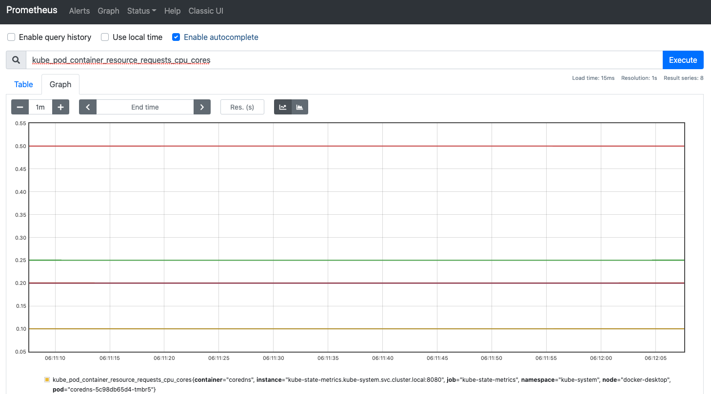

```sh
# Create namespace for monitoring resources
k create namespace monitoring
k get namespace

# Monitor resource usage from kubectl
k top nodes
k top pods
```

### Grafana

Grafana allows you to query, visualize, alert on and understand your metrics no matter where they are stored.

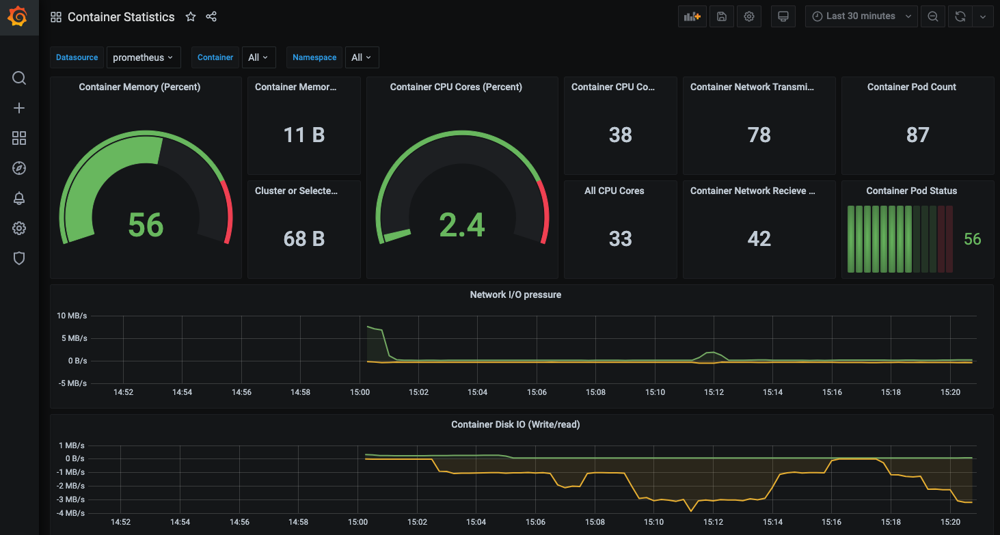

## Troubleshooting

### Key troubleshooting commands

```sh
# Get the YAML manifest for a pod
k get pod [pod-name] -o yaml

# Can view events of a pod
k describe pod [pod-name]

# Shell into a pod
k exec [pod-name] -it sh

# View logs
k logs [pod-name]
k logs -f [pod-name]

# View container log
k logs [pod-name] -c [container-name]

# View logs of a previously run pod
k logs -p [pod-name]
```