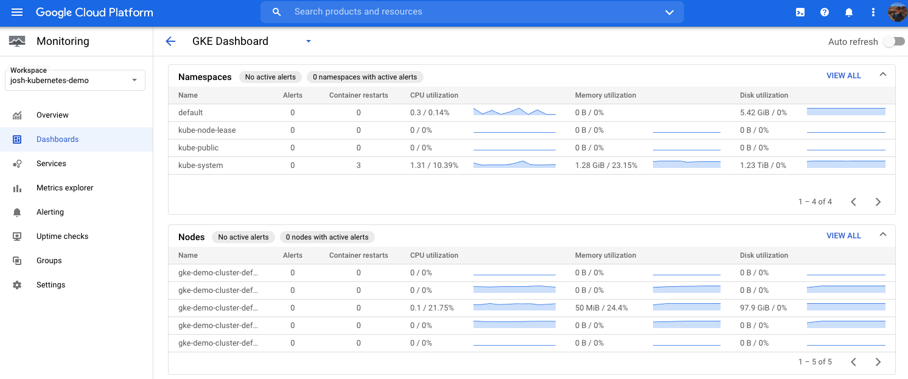
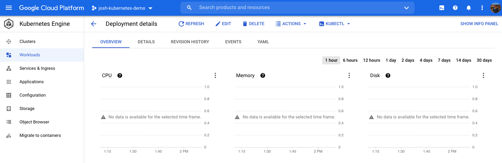
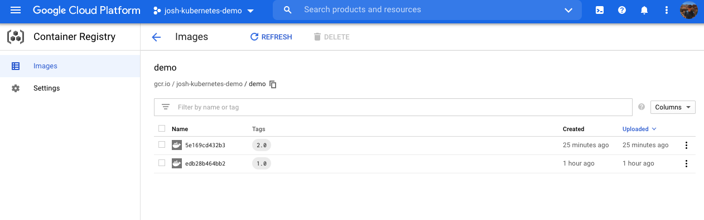

## [Kubernetes](../README.md)

# Kubernetes for Developers: Moving to the Cloud
[Course by Craig Golightly (Pluralsight)](https://app.pluralsight.com/library/courses/kubernetes-developers-moving-cloud/table-of-contents)

- [Kubernetes for Developers: Moving to the Cloud](#kubernetes-for-developers-moving-to-the-cloud)
  - [Setup](#setup)
  - [Deploy image to Google Docker Registry](#deploy-image-to-google-docker-registry)
  - [Create Cluster and Service](#create-cluster-and-service)
  - [Scale Pods and Nodes](#scale-pods-and-nodes)
  - [Update App](#update-app)
  - [Google Cloud Console](#google-cloud-console)
    - [Monitoring](#monitoring)
    - [GKE](#gke)
    - [Container Registry](#container-registry)
  - [Cleanup](#cleanup)

## Setup

1. Enable Kubernetes Engine API
2. Install Google Cloud SDK
3. Configure `gcloud`

[gcloud CLI docs](https://cloud.google.com/sdk/gcloud/reference/init)

```sh
# Initialize gcloud CLI (or create new glcoud configurations)
# 1. Authorizes gcloud to access GCP using your account credentials
# 2. Sets up a new or existing config
# 3. Sets config properties, including the current project, region and zone
gcloud init

# Login to authorize gcloud to access GCP with your user credentials
# Useful if you just want to login without setting up a new configuration
gcloud auth login
gcloud auth list

# List accounts
gcloud config configurations list

# Switch account
gcloud config configurations activate [config-name]

# List config properties for the currently active configuration
gcloud config list

# List all projects
gcloud projects list
```

## Deploy image to Google Docker Registry

In order to push an image to the Google Container Registry, the tag must follow a certain format:
- `<hostname>/<project-id>/<image-name>:<tag>`
  - hostname - host for google container registry that will store image
  - project-id - GCP project to use
  - image-name - name of the image
  - tag - tag for the image
- Example: `gcr.io/demo-project-123/demo:1.0`

```sh
# Add the docker credHelper entry to Docker's configuration file. 
# It registers gcloud as the credential helper for all 
# Google-supported Docker registries. This will allow us to push 
# docker images to google cloud registry.
gcloud auth configure-docker

# Build the image
docker build -t gcr.io/demo-project-123/demo:1.0 .

# Test the image locally by running the container
docker run -p 5000:5000 gcr.io/demo-project-123/demo:1.0

# Push image to Google Container Registry
docker push gcr.io/demo-project-123/demo:1.0

# How to remove unused docker images on your machine
# 1. Remove all stopped containers
docker container prune

# 2. Remove all unused images, not just dangling ones
docker image prune --all

# How to remove unused kubernetes context on your machine
kubectl config delete-context [context-name]
```

## Create Cluster and Service
```sh
# Create cluster (https://cloud.google.com/kubernetes-engine/docs/how-to/creating-a-regional-cluster)
# Note: Creating a cluster will change your kubernetes context
gcloud container clusters create [cluster-name] --num-nodes=3 \
--zone=asia-northeast3-a

# Check the cluster
gcloud container clusters list
gcloud container clusters describe [cluster-name]

# Check context
k config current-context
kccc

# Get all contexts
k config get-contexts
kcgc

# Switch context
k config use-context [context-name]
kcuc [context-name]

# Check the nodes that are created (will show the 3 nodes created)
k get nodes

# Create deployment
# Note: the deployment is only scheduled to one worker node
k create deployment [deployment-name] --image=gcr.io/demo-project-123/demo:1.0

# Check the deployment
k get deployments
k get pods
k get services

# Expose the deployment externally with a loadBalancer
k expose deployment [deployment-name] \
--type=LoadBalancer --port 5000 --target-port 5000

# Check the loadBalancer and grab the external IP to test the container
k get services
```

## Scale Pods and Nodes

```sh
# Scale deployments
k scale deployment [deployment-name] --replicas=3

# Scale nodes up
gcloud container clusters resize [cluster-name] --num-nodes 5

# Scale nodes down
gcloud container clusters resize [cluster-name] --num-nodes 1

# Note: when there were 3 nodes and 3 deployments, it balanced one deployment on each node.
# When we scaled down to 1 node, it had to spin up two new deployments on the single node.
```

## Update App
In order to update the application, you need to build and tag a new docker image and push it to the Google Container Registry.

```sh
# Build updated image
docker build -t gcr.io/demo-project-123/demo:2.0 .

# Push updated image
docker push gcr.io/demo-project-123/demo:2.0

# Set the deployment to the udpated image
k set image deployment/demo-app demo=gcr.io/demo-project-123/demo:2.0
```

## Google Cloud Console

### Monitoring
- Navigation Menu -> Operations -> Monitoring
- Metrics are automatically fed into `Stackdriver` so you can view charts and graphs for your GKE resources



### GKE
- Navigation Menu -> Kubernetes Engine



### Container Registry
- Navigation Menu -> Containers Registry



## Cleanup

```sh
# List services
k get services

# Delete service
k delete service [service-name]

# List clusters
gcloud container clusters list

# Delete cluster
gcloud container clusters delete [cluster-name]

# List images
gcloud container images list
gcloud container images list-tags gcr.io/demo-project-123/demo

# Delete images
gcloud container images delete gcr.io/demo-project-123/demo:1.0
gcloud container images delete gcr.io/demo-project-123/demo:2.0

```